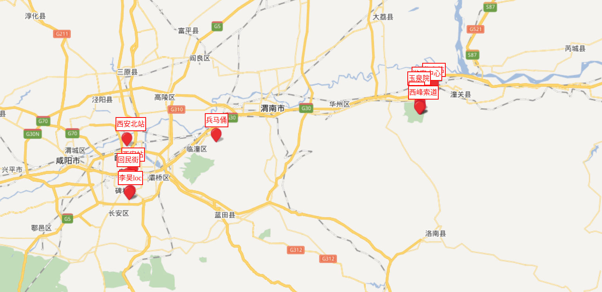

## 外出游玩攻略
将主要景点映射在百度地图上, 方便制定计划
## Usage
* `git clone git@github.com:lihao2333/map_xian.git`
* `cd map`
* `python3 manage.py makemigrations`
* `python3 manage.py migrate`
* `python3 manage.py createsuperuser` and set the username and password
* `python3 manage.py runserver 0.0.0.0:8888`
* open your browser with 'localhost:8888'
## Edit
* open your borwser with 'localhost:8888' and type the admin username and password you set before.
* add an `section` with the `name` and `loc`
* you can using [baiduAPI](http://api.map.baidu.com/lbsapi/getpoint/index.html) to get the loc
## Display

